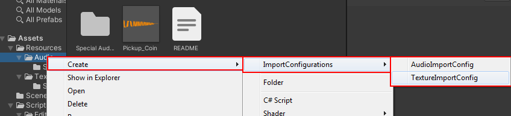
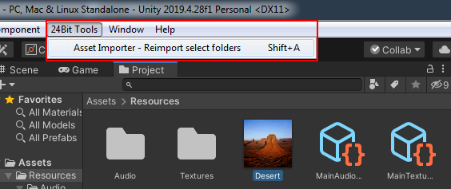
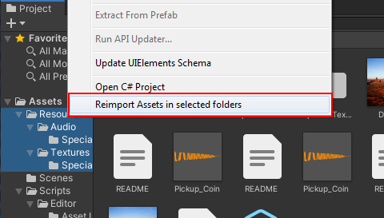

# 24Bit Asset Importer

## Brief
Create a configurable Unity Editor Tool that can change the import settings of assets when they are newly added to specific folders. The tool should also be able to retroactively run and apply the necessary changes to existing assets.

* Functionality of the tool should be as follows:
  * Execute in the Unity Editor only.
  * Execute automatically when a new asset is added to folders affected by configuration files.
  * Execute manually on selected folders in order to apply modified settings.
  * Be configured by a scriptable asset placed in the relevant asset folders, or their parents.
  * Configuration settings, when conflicting, should take precedence of the one in any child folders.

* Minimum Features of the tool required:
  * Ability to change the maximum texture size and anisotropic filtering level for texture assets.
    * Ability to optionally override the texture size for the Android platform.
  * Ability to change the sample rate, compression format and load type of audio clip assets
    * Ability to optionally override these settings for the Android platform.

## How to

Assets will automatically be imported with the closest-non-child config file.
 
To Create a config file Right-click for the create menu and select one of the config file options.
 

 
Once the config file has been setup it will automatically be used.
If you want to manually trigger a settings reimport, you can click on a folder or any asset in a folder and either click the reimport option in the tool bar or use the hotkey Shift+A.
 

 
You can also select multiple folders to reimport all of them. Additionally you can right click on a asset or folder in your selection and reimport via the context menu.
 
